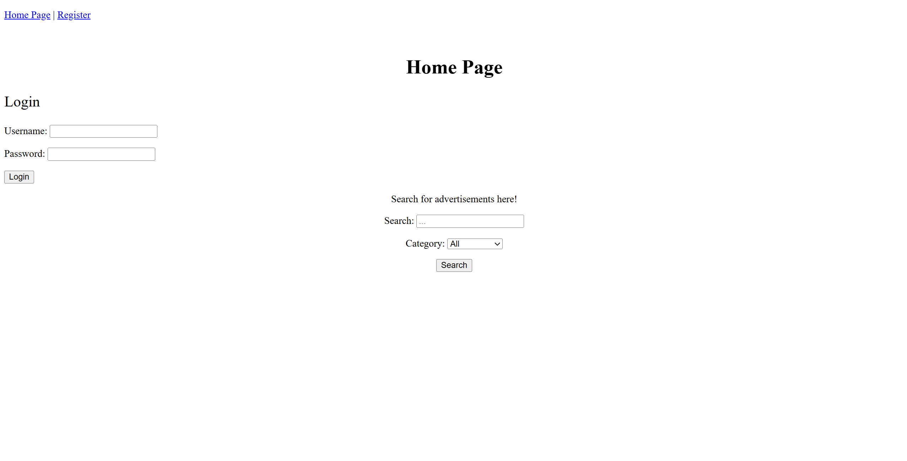
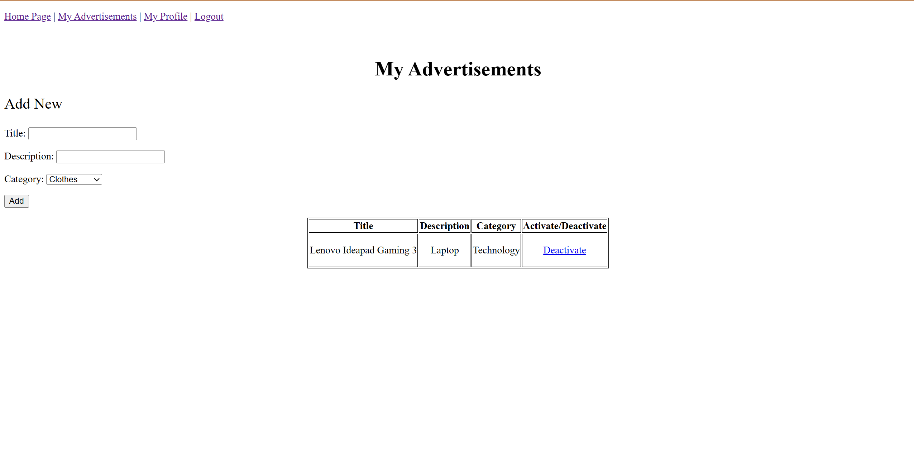
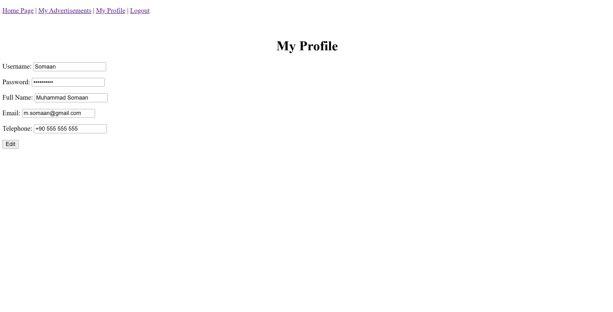

# Web Advertisement Platform with Flask

Designed and developed a full-stack web application using Python (Flask) and SQLite, enabling users to register, log in, post, manage, and search categorized advertisements through an interactive web interface.


---

## 🚀 Core Features

This application functions as a complete, self-contained classified ads platform.

* **User Authentication:** Full user workflow for registration, login, and logout using secure server-side session management (`flask_login`).
* **Ad Management (CRUD):** Logged-in users can create new advertisements, view their own ads, and activate/deactivate them.
* **Profile Management:** Users can update their personal information in a dedicated profile page.
* **Dynamic Search:** A public-facing search feature allows anyone to find ads. Results are dynamically filtered and displayed grouped by category.
* **Detailed Views:** Clicking any ad from the search results leads to a detailed view with complete information.
* **Client-Side Validation:** The registration form uses JavaScript to provide real-time validation feedback to the user, improving the user experience.



---

## 🛠️ Technology Stack & Architecture

### Backend (`app.py`)
* **Framework:** **Flask** is used to handle all routing, request handling, and server-side logic.
* **Database:** **SQLite** provides a lightweight, persistent database for all application data. The schema and sample data are created by `dbscript.py`.
* **Templating:** **Jinja2** (built into Flask) is used to dynamically render HTML templates (`base.html`, `index.html`, etc.) by passing data from the server to the client.
* **Authentication:** **Flask-Login** is used to manage user sessions and protect routes that require a user to be logged in.

### Frontend
* **Structure:** **HTML5** (in the `templates/` directory).
* **Styling:** **CSS** (in `static/mystyle.css`).
* **Interactivity:** **JavaScript** (in `static/myjs.js`) is used for client-side form validation, ensuring fields like email and password meet requirements before submitting.




### Database Schema
The SQLite database (`website.db`) consists of three primary tables, established by `dbscript.py`:

1.  **`Users`:** Stores user information, including a hashed password for security.
2.  **`Categories`:** A simple lookup table for ad categories (e.g., "Electronics," "Clothing," "Vehicles").
3.  **`Advertisements`:** The main table for ad postings, linked to the `Users` table by a `user_id` and the `Categories` table by a `category_id`.

---

## 🚀 How to Run

### 1. Prerequisites
* Python 3
* Flask (`pip install Flask`)
* Flask-Login (`pip install flask-login`)

### 2. Setup
1.  Clone the repository.
2.  (Optional but Recommended) Create and activate a Python virtual environment:
     ```bash
     python -m venv venv
     source venv/bin/activate  # On Windows: venv\Scripts\activate
     ```
3.  Install the required packages:
     ```bash
     pip install Flask flask-login
     ```
4.  Initialize the database. **Run this script only once.**
     ```bash
     python dbscript.py
     ```
     This will create `website.db` and populate it with sample categories.

### 3. Run the Application
1.  Run the Flask server:
     ```bash
     python app.py
     ```
2.  Open your web browser and navigate to:
     ```
     [http://127.0.0.1:5000/](http://127.0.0.1:5000/)
     ```